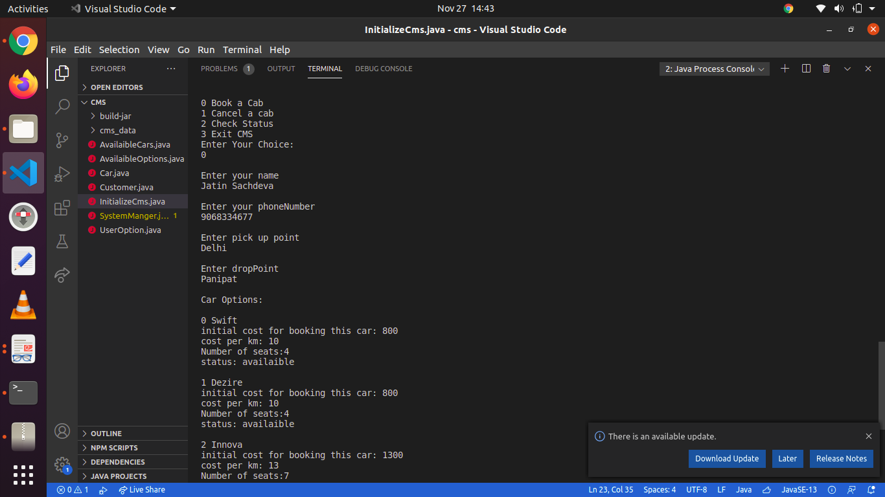
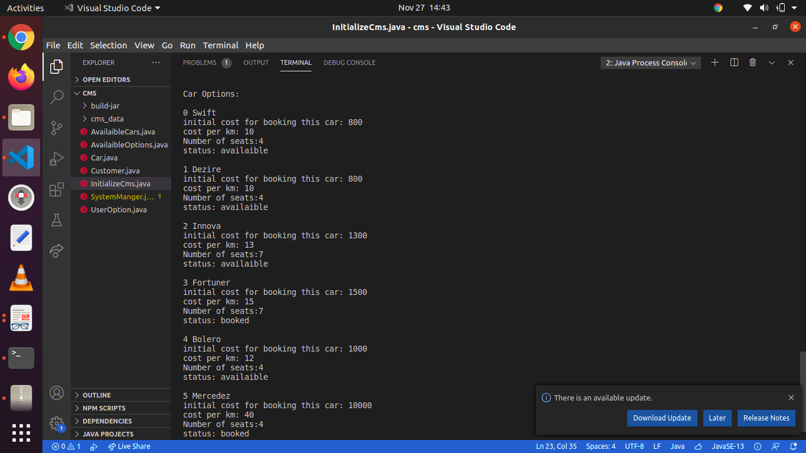
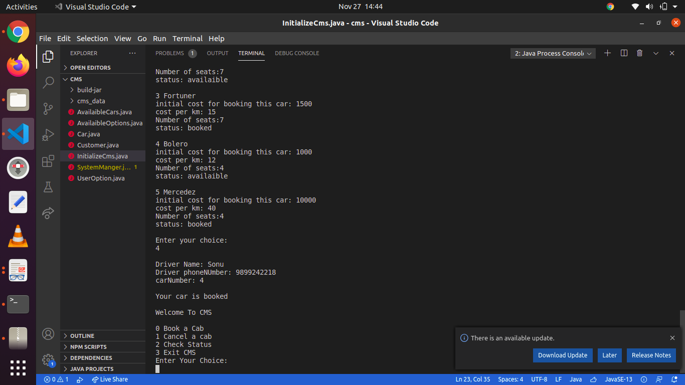
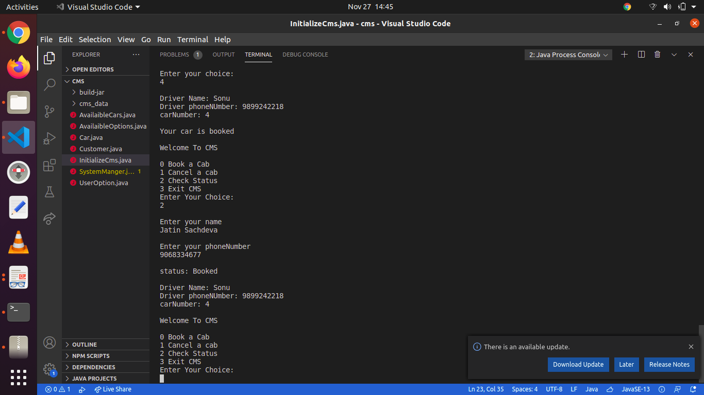
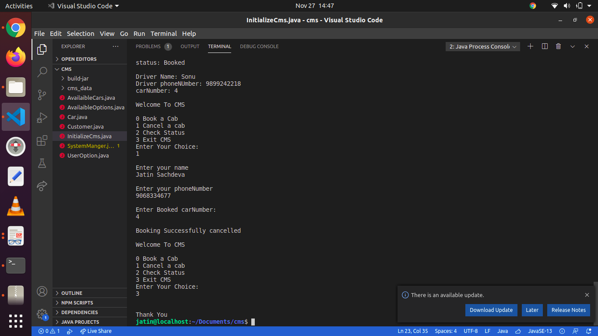

# Cab-Management-System

It is a simple console based Cab Mangement System made with Java . It also uses object oriented principle like encapsulation etc.
<pre>
CMS has 4 options:
1 Book  a car

Enter your name,phone number,pick up point ,drop point and carNumber from availaible cars.It will give you booked car driver info.

2 Check Status

Enter your name and phone number. It will check whether there is car booked on your name and return driver info accordingly.

3 Cancel Booking

Enter your name, phone number and car number. It will cancel booking,if there is car booked with entered credential.

4 Exit cms

Exit the cms and save status of booked car and customer info to file.

</pre>

# Screenshots:
 1. Book a car
 

2. Check Status

3. cancel Booking or Exit Cms

