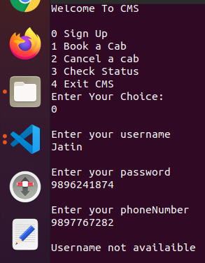
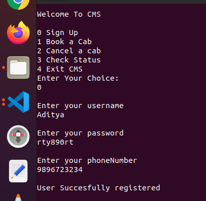
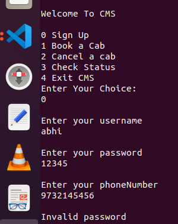
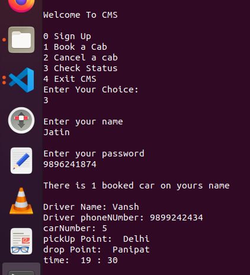
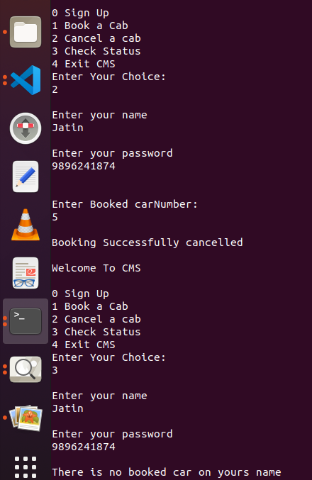
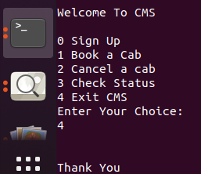

# Cab-Management-System

It is a simple console based Cab Mangement System made with Java . It also uses object oriented principle like encapsulation etc. 
<pre>

CMS has 5 options:
1 Sign Up

To book a cab with CMS you first have to sign up to CMS. To sign up you have to enter your username, password and phoneNumber. You will be successfully registered if username entered is not already in use, password length is > = 8.

2 Book  a car

Enter your username,password,time,pick up point ,drop point and carNumber from availaible cars.It will give you booked car driver info. You can book cab for today only.

3 Check Status

Enter your username and password. It will check whether there is car booked on your name and return driver info accordingly.

4 Cancel Booking

Enter your username, password and car number. It will cancel booking,if there is car booked with entered credential.

5 Exit cms

Exit the cms and save status of booked car and customer info to file.

</pre>

# Screenshots:

 1. Sign Up 

 
 
 
 
 2. Book a car
 

3. Check Status

4. cancel Booking

5. Exit

